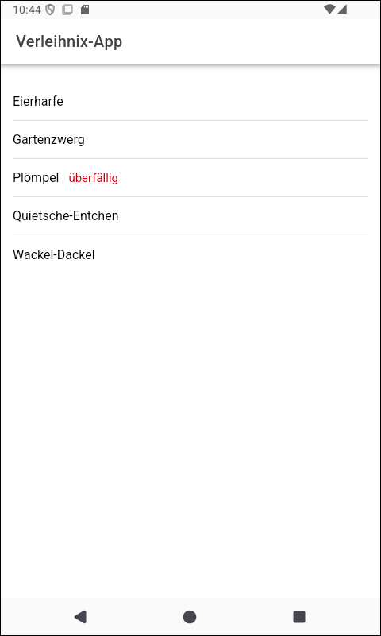
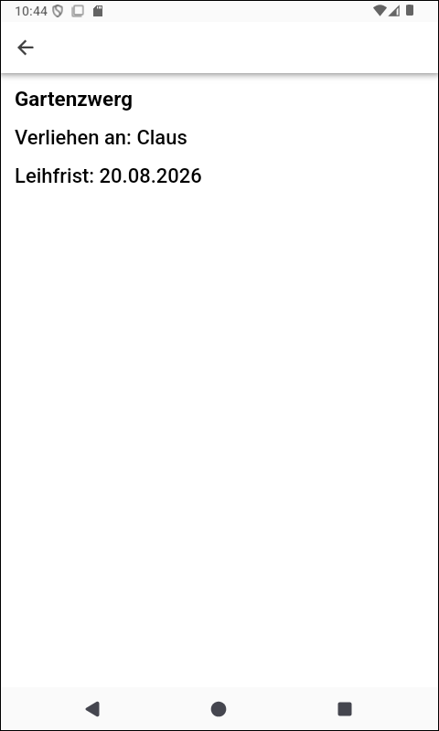

# Ionic-App "Verleihliste "#

 

Dieses Repo enthält eine Angular/Ionic-App, die die Verwendung des Ionic-Templates "list" demonstriert,
was auch eine eigene Komponente beinhaltet.

 

----

## Screenshots ##

 

 &nbsp; 

 

----

## License ##

 

See the [LICENSE file](LICENSE.md) for license rights and limitations (BSD 3-Clause License).

 
